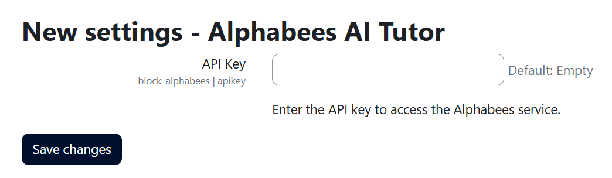
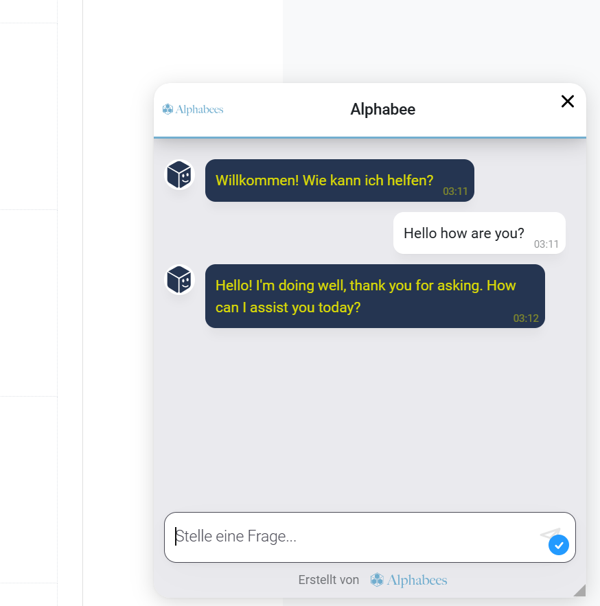
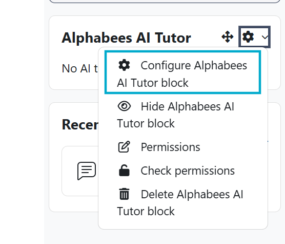
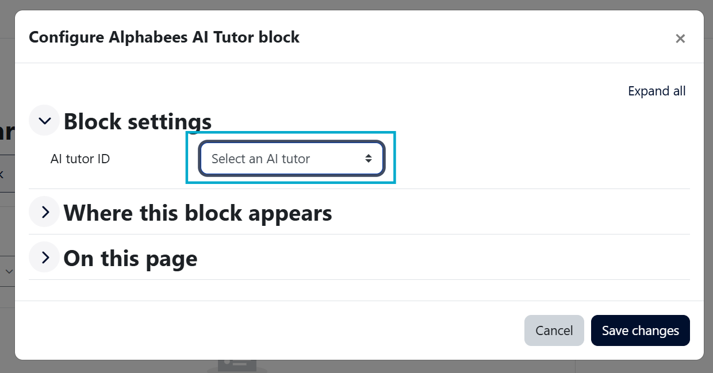
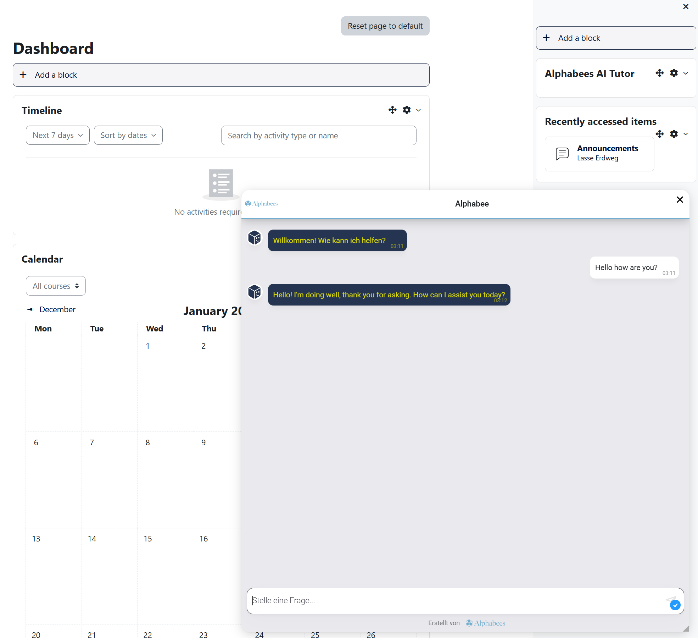
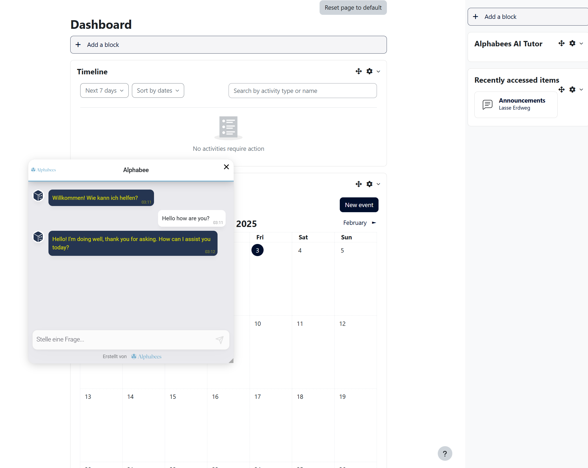

# Alphabees Moodle Plugin  

## Overview  
The **Alphabees Moodle Plugin** integrates a powerful AI tutor chat widget into Moodle, enabling precise placement using Moodle's block structure. It seamlessly combines integration with a high-quality custom UI and backend, fully customizable through the Alphabees portal.  

This plugin leverages Moodle's flexible block placement capabilities while incorporating robust WebSocket-driven communication and advanced customization options, ensuring a high-performance and user-friendly AI tutoring solution.  

---

## How It Works: Alphabees AI Tutor Integration  

### **Step 1: Register on the Alphabees Portal**  
Start by registering at [portal.alphabees.de](https://portal.alphabees.de), where you can:  
- Upload files and connect external data sources (e.g., websites) to build a custom knowledge base.  
- Design chat widget styles with customizable options, including:  
  - Logo and placeholder messages.  
  - Colors and fonts.  
  - Placement on the screen (e.g., bottom-right, bottom-left, center).  

### **Step 2: Configure AI Tutors**  
Create AI tutors using templates such as Q&A Tutor or Tutor Mode. Customize each tutor with:  
- Assigned knowledge bases.  
- Chat widget styles.  
- Behavior settings:  
  - Tone, engagement level, and strict topic adherence.  
  - Enable live web search or include sources.  
- AI model providers like OpenAI, Anthropic, or Meta.  
- Custom prompt instructions for tailored interactions.  

### **Step 3: Deploy the AI Tutor**  
Deploy your AI tutor in two ways:  
- **Embed on Websites**: Use an HTML snippet to add the tutor to any website.  
- **Integrate with Moodle**: Install the Alphabees Moodle block plugin for seamless deployment within Moodle environments.  

### **Step 4: Integrate with Moodle**  
1. Generate an API key from the Alphabees portal.  
2. Enter the API key into the admin settings of the Alphabees Moodle plugin.  
3. Add the Alphabees block plugin wherever needed within Moodle.  
4. In the block settings, select the desired AI tutor from a dropdown list of tutors created in the Alphabees portal.  
5. Once configured, the AI tutor is ready to interact with Moodle users.

---

## Features  

- **Granular Placement Control**: Place the chat widget in specific courses, dashboards, or other Moodle pages using block functionality.  
- **High-Quality UI**: The chat widget features an advanced, responsive design independent of Moodle’s UI.  
- **Customizable Styling**: Configure widget colors, fonts, logos, and placement via the Alphabees portal.  
- **AI-Powered Tutoring**: Supports AI-driven interaction for answering questions and engaging with learners in real time.  
- **WebSocket Communication**: Real-time chat experience powered by WebSockets for fast, seamless interactions.  
- **Multi-language Support**: Available in English and German for broader accessibility.  
- **File Metadata Options**: Add metadata such as readability index, tone of voice, and persona to enhance AI responses.  

---

## Installation

The **Alphabees Moodle Plugin** can be installed in two ways:

## **1. Installation via Moodle Plugin Directory (Recommended)**
1. Log in to your Moodle site as an administrator.
2. Go to **Site Administration > Plugins > Install Plugins**.
3. Search for *"Alphabees"* in the Plugin Directory.
4. Click **Install now** to download and install the plugin.
5. Follow the on-screen prompts to complete the installation.
6. Navigate to **Site Administration > Plugins > Blocks > Alphabees** to configure the plugin.

## **2. Installation via Moodle's Built-in Plugin Installer (ZIP File)**
1. Download the latest plugin ZIP file from the repository: [Alphabees Moodle Plugin ZIP](./releases/moodle-block_alphabees.zip).
2. Log in to your Moodle site as an administrator.
3. Go to **Site Administration > Plugins > Install Plugins**.
4. Upload the ZIP file and click **Install plugin**.
5. Follow the on-screen prompts to finalize the installation.
6. Navigate to **Site Administration > Plugins > Blocks > Alphabees** to configure the plugin.

---

For more detailed instructions, visit the [Installation Wiki](https://github.com/LErdweg/moodle-block_alphabees/wiki/Installation).

---

## Configuration
0. Register a free or paid Account on portal.alphabees.de and retrieve your API key

1. Enter your API key from the Alphabees portal in the plugin settings.  

2. Customize the chat widget appearance through the Alphabees portal, including colors, fonts, logos, and placement.

3. Add the Alphabees block to specific courses or pages in Moodle.  

4. Use the block settings to select the desired AI tutor from the dropdown list.  

## Customizations
1. Change size of chat window.

2. Change position of chat window.

---

## Free and Paid Plans  

### 1. Free Plan (Ideal for small teams & individuals)
- 1 AI Tutor**
- 30 conversations per month**
- 3 data sources**
- Basic Q&A AI Tutor**
- Access to the admin portal**
- Cost: €0 (Free Forever)**

### 2. Basic Plan (€99/month)
- 5 AI Tutors**
- 2,000 conversations per month**
- 50 data sources**
- Custom chat design with branding**
- Email support**

### 3. Professional Plan (€249/month)
- 20 AI Tutors**
- 5,000 conversations per month**
- 50 data sources**
- Custom chat design without branding**
- Email support**

For enterprise pricing, please contact us directly via the Alphabees portal. 

---

## Usage  

1. Add the **Alphabees AI Tutor** block to a Moodle course or desired page.  
2. Upload files and include metadata (if applicable) to optimize AI interactions.  
3. Style the widget via the Alphabees portal to align with your branding.  
4. Interact with the AI tutor through the dynamic chat widget, powered by real-time WebSocket communication.  

---

## Development and Contributions  

- **GitHub Repository**: [moodle-block_alphabees](https://github.com/LErdweg/moodle-block_alphabees)  
- Contributions are welcome! Please fork the repository, make your changes, and submit a pull request.  

---

## Privacy  

This plugin complies with Moodle's privacy policies. It does not store personal data on Moodle but communicates with the Alphabees backend. For more information, refer to the `PRIVACY.md` file.  

---

## License  

This plugin is licensed under the GNU General Public License v3.0. For more details, see the `LICENSE` file included in the repository.  

## Proprietary Components

The Alphabees Chat Widget is a proprietary, externally hosted JavaScript file dynamically loaded into Moodle via this plugin.
To ensure consistency and efficiency, the widget is centrally managed and versioned on our servers. This approach reduces maintenance overhead across plugins for different LMS platforms, enabling seamless updates and a consistent user experience.
As part of our business model, the chat widget generates revenue to finance ongoing operations and development. For this reason, it is not open-source, though the Moodle plugin code remains fully open-source and compliant with Moodle's development standards.

---

## Support  

For issues, please:  
- Report them via [GitHub Issues](https://github.com/LErdweg/moodle-block_alphabees/issues).  
- Contact support at [support@alphabees.de](mailto:support@alphabees.de).  

